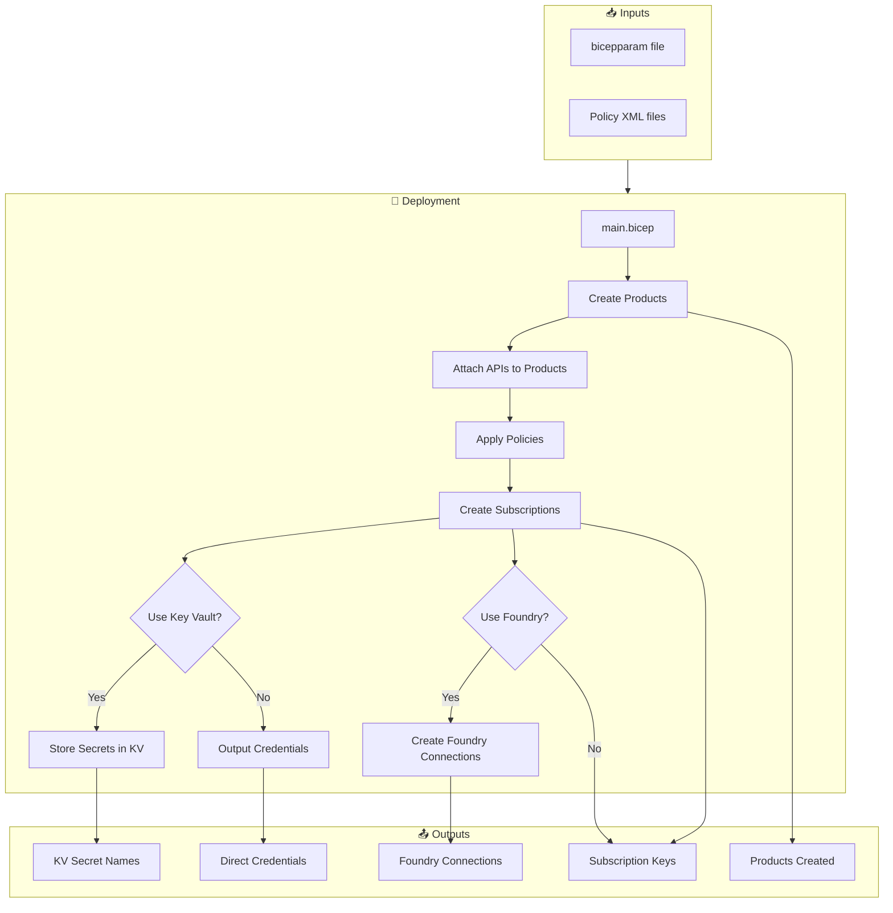
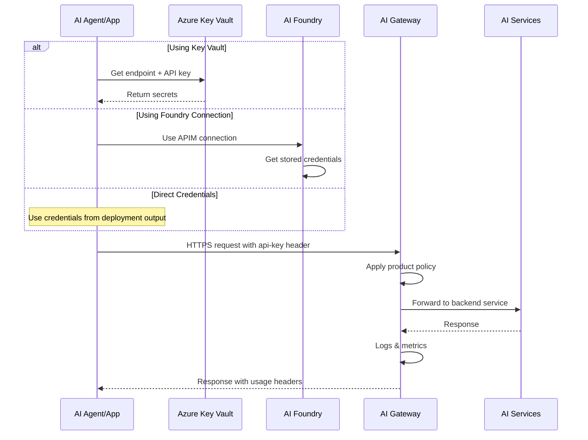

# 🚀 Use Case Onboarding for AI Citadel Governance Hub

## Overview

Automate the onboarding of AI use cases to your APIM-based AI Gateway with a streamlined, infrastructure-as-code approach using **Bicep parameter files** (`.bicepparam`).

This package eliminates manual APIM configuration by providing:
- 📦 **Automated Product Creation**: Per-service APIM products with naming `<serviceCode>-<BU>-<UseCase>-<ENV>`
- 🔌 **API Integration**: Automatic API attachment to product with custom or default policies
- 🔑 **Subscription Management**: Auto-generated subscription with secure API keys
- 🔐 **Flexible Secret Storage**: Optional Azure Key Vault integration or direct credential output
- 🤖 **Azure AI Foundry Integration**: Optional APIM connection creation for Foundry agents
- 📝 **Declarative Configuration**: Simple `.bicepparam` & `.xml` files for version control per use case

## What Gets Created

| Resource | Naming Pattern | Description |
|----------|----------------|-------------|
| **APIM Product** | `{code}-{BU}-{UseCase}-{ENV}` | Product per service (e.g., `LLM-Healthcare-PatientAssistant-DEV`) with attached APIs and policies |
| **APIM Subscription** | `{product}-SUB-01` | Subscription with API key |
| **Key Vault Secrets** | `{secretName}` | Endpoint URL and API key (optional) |
| **Foundry Connection** | `{prefix}-{code}` | APIM connection for AI Foundry agents (optional) |

## Key Features

✨ **Simplified Parameters**: No need for full resource IDs - just API names  
🔄 **Optional Key Vault**: Choose between Key Vault storage or direct output  
🤖 **Optional Foundry Integration**: Create APIM connections for AI agents  
📋 **Policy Templates**: Pre-built policies for common use cases  
🎯 **Multi-Service Support**: Onboard multiple AI services in one deployment  
🔒 **Secure by Default**: Credentials stored in Key Vault or marked as secrets  
📊 **Production Ready**: Designed for scale and aligned with DevOps practices 
---

## Deployment quick reference

below are the high-level steps to deploy the use case onboarding Bicep package before diving into the detailed documentation:

0. **Create a folder dedicated for use-cases contracts**: a folder like `contracts` in the citadel-access-contracts module to hold your use case specific files. 
1. **Create a use-case contract folder**: under the contracts folder, create a new folder for your use case following the pattern `<businessunit>-<usecasename>` (e.g. `sales-assistant`, `hr-chatagent`).
2. **Create an environment subfolder**: under the use case folder, create a subfolder for each environment (e.g. `dev`, `test`, `prod`).
3. **Prepare Parameter File**: Create new use case `.bicepparam` file (you can use `main.bicepparam` as a base) under the environment folder.
4. **Create/Customize APIM Policy**: Use default or create a custom XML policy. For simplicity, policy file can be named `ai-product-policy.xml` and placed in the same environment folder.
5. **Deploy template with the prepared parameter file**:
```bash
# This can be executed in CLI or through a DevOps pipeline
az deployment sub create --name <use-case-contract-name> --location <location> --template-file main.bicep --parameters contracts/<businessunit-usecasename>/<environment>/main.bicepparam
```

>NOTE: Ensure that you are updating values according to your environment and folder structure.

## 🗺️ Architecture Overview

### Deployment Flow



### Runtime Request Flow

Below is a suggested flow for client applications (i.e. agents) interacting with the onboarded services via the Citadel Access Contracts:



---

## 📁 Repository Structure

This is a submodule focused on Citadel Access Contracts. The folder structure is as follows:

```
citadel-access-contracts/
├── main.bicep                          # Main orchestration template
├── main.bicepparam                     # Base parameter file
├── modules/
│   ├── apimOnboardService.bicep        # Product + subscription creation
│   ├── apimProduct.bicep               # APIM product module
│   ├── apimSubscription.bicep          # Subscription module
│   ├── kvSecrets.bicep                 # Key Vault secret storage
│   └── foundryConnection.bicep         # Azure AI Foundry connection module
├── policies/
│   └── default-ai-product-policy.xml   # Default product policy
├── contracts/                          # Use-case contracts folder for source control 
│   └── <businessunit-usecasename>/     # Use case folder (e.g., sales-assistant)
│       ├── dev/                        # Environment subfolder
│       │   ├── main.bicepparam         # Use case specific parameters
│       │   └── ai-product-policy.xml   # Custom policy file
│       ├── test/                       # Test environment
│       │   ├── main.bicepparam
│       │   └── ai-product-policy.xml
│       └── prod/                       # Production environment
│           ├── main.bicepparam
│           └── ai-product-policy.xml
└── samples/
    ├── healthcare-chatbot/             # Sample: Healthcare AI
    │   ├── dev/
    │   │   ├── main.bicepparam         # Deployment parameters
    │   │   └── ai-product-policy.xml   # Custom APIM policy
    │   └── prod/
    │       ├── main.bicepparam
    │       └── ai-product-policy.xml
    └── customer-support-agent/         # Sample: Support AI
        └── dev/
            ├── main.bicepparam
            └── ai-product-policy.xml
```

---

## 🔧 Parameter File Reference

### Main Parameters (main.bicepparam)

| Parameter | Type | Required | Description | Example |
|-----------|------|----------|-------------|---------|
| `apim` | object | ✅ | APIM instance coordinates | `{ subscriptionId, resourceGroupName, name }` |
| `keyVault` | object | ✅* | Key Vault for secrets (*required even if not used) | `{ subscriptionId, resourceGroupName, name }` |
| `useTargetAzureKeyVault` | bool | ❌ | Store secrets in Key Vault (default: `false`) | `true` or `false` |
| `useCase` | object | ✅ | Use case naming context | `{ businessUnit, useCaseName, environment }` |
| `apiNameMapping` | object | ✅ | Map service codes to API names | `{ OAI: ["azure-openai-service-api"], ... }` |
| `services` | array | ✅ | Services to onboard | See [Services Schema](#services-schema) below |
| `productTerms` | string | ❌ | Product terms of service | "By using this product..." |
| `useTargetFoundry` | bool | ❌ | Create Foundry connections (default: `false`) | `true` or `false` |
| `foundry` | object | ❌* | AI Foundry coordinates (*required if useTargetFoundry=true) | `{ subscriptionId, resourceGroupName, accountName, projectName }` |
| `foundryConfig` | object | ❌ | Foundry connection configuration | See [Foundry Config](#foundry-configuration) below |


#### Service Code mapping

Map service codes (which is a short acronym that represents the category of services fall under) to their API-id in APIM:

```bicep
{
  LLM: ["azure-openai-api", "universal-llm-api"]
  OAIRT: ["openai-realtime-ws-api"]
  DOC: ["document-intelligence-api", "document-intelligence-api-legacy"]
  SRCH: ["azure-ai-search-index-api"]
  // ... add more services
}

```

**Note**: API-id must already exist in your APIM instance. The deployment will fail if an API name is not found.

Above is the list of supported APIs that are provisioned by default by the accelerator.

#### Adding custom APIs

You can onboard any number of other APIs as well to support your custom services. Add the newly added API-ids to the mapping above accordingly.

#### Multi-service Bundles

Mapping currently is suggested to focus on a specific category of services (e.g., LLM, Document Intelligence, etc.)

You can create unique mappings that mix different service types under one bundle if needed (this will require the product policy to be aware of that mix to apply the correct policies based on the service type like using tokens-per-mint limits for LLM and request-per-min limits for Document Intelligence).

#### Use-case service assignment schema

Each service in the `services` array:

```bicep
{
  code: string              // Service code (e.g., "LLM", "DOC", "SRCH")
  endpointSecretName: string // Name for endpoint secret in Key Vault
  apiKeySecretName: string   // Name for API key secret in Key Vault
  policyXml: string          // Optional: Custom policy XML (empty = use default)
}
```

This will create one APIM product + subscription + Key Vault secrets per service code and leverage the referenced policy XML for that product.

This is an array to allow multiple services to be assigned to specific use case (like granting both LLM and document intelligence access to the same application).

But each service will have its own product + subscription + secrets (i.e llm will have a different key from document intelligence).

---

## 🧱 What gets created

| Component | Scope | Naming | Notes |
|-----------|-------|--------|-------|
| APIM Product | APIM | `<serviceCode>-<BU>-<UseCase>-<ENV>` | One per service code you include |
| APIM Subscription | APIM | `<product>-SUB-01` | Primary key is captured into Key Vault |
| Key Vault Secrets | KV | `endpointSecretName`, `apiKeySecretName` | One endpoint + one key per service |
| Foundry Connection | AI Foundry | `<prefix>-<serviceCode>` | One connection per service (if enabled) |

Naming examples
- Product: `LLM-Retail-FinancialAssistant-DEV`
- Subscription: `LLM-Retail-FinancialAssistant-DEV-SUB-01`
- Foundry Connection: `Retail-FinancialAssistant-DEV-LLM`

---

## ✅ Prerequisites

### Azure Resources

| Resource | Requirement | How to Verify |
|----------|-------------|---------------|
| **Citadel Compliant APIM Instance** | with published APIs matching your `apiNameMapping` | `az apim api list -g <rg> -n <apim-name>` |
| **Azure Key Vault** | Accessible with secret set permissions (if using KV) | `az keyvault show -n <kv-name>` |
| **Azure AI Foundry** | Account and project must exist (if using Foundry) | `az cognitiveservices account show -n <account-name> -g <rg>` |

### Permissions Required

The deployment identity needs:

| Scope | Role | Purpose |
|-------|------|---------|
| APIM Resource Group | `API Management Service Contributor` | Create products and subscriptions |
| Target Key Vault (if used) | `Key Vault Secrets Officer` | Write secrets |
| AI Foundry Resource Group (if used) | `Contributor` | Create connections |
| Subscription | `Reader` | Reference existing resources |

---

## ⚡ Quick Start Guide

### Step 1: Create use case folder with environment subfolder

Create a folder structure following the pattern `contracts/<businessunit-usecasename>/<environment>/` with copies of both the main.bicepparam and default policy as a base.

```powershell
# Create the folder structure: contracts/healthcare-chatbot/dev/
mkdir -p bicep/infra/citadel-access-contracts/contracts/healthcare-chatbot/dev
cd bicep/infra/citadel-access-contracts/contracts/healthcare-chatbot/dev

# Copy template files (note: path goes up 3 levels due to environment subfolder)
cp ../../../main.bicepparam main.bicepparam
cp ../../../policies/default-ai-product-policy.xml ai-product-policy.xml
```


### Step 2: Configure Your Parameters

```powershell
# Edit main.bicepparam in the environment folder
code main.bicepparam
```

Update these values:

```bicep
using '../../../main.bicep'

param apim = {
  subscriptionId: 'YOUR-SUBSCRIPTION-ID'        // ← Update
  resourceGroupName: 'YOUR-APIM-RESOURCE-GROUP'  // ← Update
  name: 'YOUR-APIM-NAME'                        // ← Update
}

param keyVault = {
  subscriptionId: 'YOUR-SUBSCRIPTION-ID'        // ← Update
  resourceGroupName: 'YOUR-KV-RESOURCE-GROUP'   // ← Update
  name: 'YOUR-KV-NAME'                          // ← Update
}

param useTargetAzureKeyVault = true  // false to output credentials directly

param useCase = {
  businessUnit: 'YourDepartment'     // ← Update
  useCaseName: 'YourUseCaseName'     // ← Update
  environment: 'DEV'                 // DEV, TEST, PROD
}

// Verify these API names exist in your APIM
param apiNameMapping = {
  LLM: ['azure-openai-api', 'universal-llm-api']
  DOC: ['document-intelligence-api', 'document-intelligence-api-legacy']
}

param services = [
  {
    code: 'LLM'
    endpointSecretName: 'OPENAI-ENDPOINT'
    apiKeySecretName: 'OPENAI-API-KEY'
    policyXml: loadTextContent('ai-product-policy.xml')  // or '' for default
  }
  // Add more services as needed
]
```

### Step 3: Validate Configuration

```powershell
# Preview what will be created (run from the environment folder)
az deployment sub what-if `
  --location swedencentral `
  --template-file ../../../main.bicep `
  --parameters main.bicepparam
```

### Step 4: Deploy

```powershell
# Deploy at subscription scope (run from the environment folder)
az deployment sub create `
  --name healthcare-chatbot-dev-onboarding `
  --location swedencentral `
  --template-file ../../../main.bicep `
  --parameters main.bicepparam

# Or run from the citadel-access-contracts root folder:
az deployment sub create `
  --name healthcare-chatbot-dev-onboarding `
  --location swedencentral `
  --template-file main.bicep `
  --parameters contracts/healthcare-chatbot/dev/main.bicepparam
```

### Step 5: Verify Deployment

```powershell
# Check products created
az apim product list `
  --resource-group YOUR-APIM-RG `
  --service-name YOUR-APIM-NAME `
  --query "[?contains(name, 'REPLACE-PRODUCT-NAME')].{Name:name, State:state}"

# If using Key Vault, check secrets
az keyvault secret list `
  --vault-name YOUR-KV-NAME `
  --query "[?contains(name, 'openai')].name"
```

### Step 6: Use the Service

```python
from azure.identity import DefaultAzureCredential
from azure.keyvault.secrets import SecretClient

# Get credentials from Key Vault
credential = DefaultAzureCredential()
kv_client = SecretClient(
    vault_url="https://YOUR-KV-NAME.vault.azure.net/",
    credential=credential
)

endpoint = kv_client.get_secret("openai-endpoint").value
api_key = kv_client.get_secret("openai-api-key").value

# Use with your application
print(f"Endpoint: {endpoint}")
# api_key is ready to use as api-key header
```

Also you can use the [citadel-access-contracts-tests](../../../validation/citadel-access-contracts-tests.ipynb) notebook to validate end-to-end connectivity of the newly created access contract.

---

## 🔑 Secret Management Options

Access contract generates sensitive keys for each service onboarded. You have two options to manage these secrets:

### Option 1: Use Key Vault (Recommended)

**When to use**: Production deployments, applications with managed identities

```bicep
param useTargetAzureKeyVault = true

param keyVault = {
  subscriptionId: 'YOUR-SUB-ID'
  resourceGroupName: 'YOUR-KV-RG'
  name: 'YOUR-KV-NAME'
}
```

**Benefits**:
- ✅ Centralized secret management
- ✅ Automatic rotation support
- ✅ Access auditing
- ✅ Integration with managed identities

**Retrieval**:
```python
from azure.keyvault.secrets import SecretClient
kv_client = SecretClient(vault_url="https://<kv-name>.vault.azure.net/", credential=credential)
endpoint = kv_client.get_secret("llm-endpoint").value
```

### Option 2: Direct Output (CI/CD)

**When to use**: CI/CD pipelines, serverless functions, non-Azure environments where these values needs to be stored in some other secret store

```bicep
param useTargetAzureKeyVault = false

// keyVault still required but can use placeholders as values are not considered.
param keyVault = {
  subscriptionId: '00000000-0000-0000-0000-000000000000'
  resourceGroupName: 'placeholder'
  name: 'placeholder'
}
```

**Benefits**:
- ✅ No Key Vault dependency
- ✅ Direct credential access
- ✅ Works in any environment

**Retrieval from Deployment Output**:
```powershell
$output = az deployment sub show `
  --name my-deployment `
  --query properties.outputs.endpoints.value -o json | ConvertFrom-Json

$oaiEndpoint = ($output | Where-Object { $_.code -eq 'LLM' }).endpoint
$oaiKey = ($output | Where-Object { $_.code -eq 'LLM' }).apiKey

# Store in CI/CD variables (NOT RECOMMENDED. Just for demonstration)
Write-Host "##vso[task.setvariable variable=LLM_ENDPOINT;issecret=true]$oaiEndpoint"
Write-Host "##vso[task.setvariable variable=LLM_KEY;issecret=true]$oaiKey"
```

⚠️ **Security Note**: When using direct output, handle credentials as secrets in your CI/CD system.

### Option 3: Use Microsoft Foundry Connections (Recommended for Agents)

**When to use**: Building AI agents in Microsoft Foundry that need APIM gateway access

```bicep
param useTargetFoundry = true

param foundry = {
  subscriptionId: 'YOUR-FOUNDRY-SUB-ID'
  resourceGroupName: 'YOUR-FOUNDRY-RG'
  accountName: 'YOUR-FOUNDRY-ACCOUNT'
  projectName: 'YOUR-PROJECT-NAME'
}

param foundryConfig = {
  connectionNamePrefix: ''        // Empty = use useCase naming
  deploymentInPath: 'false'       // Model in request body
  isSharedToAll: false            // Share with project users
  inferenceAPIVersion: ''         // APIM defaults
  deploymentAPIVersion: ''        // APIM defaults
  staticModels: []                // Dynamic discovery
  listModelsEndpoint: ''          // APIM defaults
  getModelEndpoint: ''            // APIM defaults
  deploymentProvider: ''          // AzureOpenAI format
  customHeaders: {}               // No custom headers
  authConfig: {}                  // Default api-key header
}
```

**Benefits**:
- ✅ Seamless integration with AI Foundry agents
- ✅ Credentials stored securely in Foundry connection
- ✅ Supports the "Bring Your Own AI Gateway" pattern
- ✅ Automatic model discovery from APIM
- ✅ No need to manage secrets separately

**Usage in Foundry Agent**:

```python
import os
from azure.ai.projects import AIProjectClient
from azure.identity import DefaultAzureCredential

# Connection name follows pattern: <prefix>-<serviceCode>
# Example: HR-ChatBot-DEV-LLM
connection_name = "HR-ChatBot-DEV-LLM"
model_deployment = f"{connection_name}/gpt-4o"

os.environ["AZURE_AI_MODEL_DEPLOYMENT_NAME"] = model_deployment

client = AIProjectClient(
    credential=DefaultAzureCredential(),
    endpoint="https://your-foundry.cognitiveservices.azure.com/"
)

# Create agent using the APIM connection
agent = client.agents.create_agent(
    model=model_deployment,
    name="my-hr-assistant",
    instructions="You are a helpful HR assistant."
)
```

### Foundry Configuration Options

| Option | Type | Default | Description |
|--------|------|---------|-------------|
| `connectionNamePrefix` | string | `''` | Custom prefix for connection names. Empty uses `<BU>-<UseCase>-<ENV>` |
| `deploymentInPath` | string | `'false'` | `'true'`: model in URL, `'false'`: model in body |
| `isSharedToAll` | bool | `false` | Share connection with all project users |
| `inferenceAPIVersion` | string | `''` | API version for chat/embeddings (empty = APIM defaults) |
| `deploymentAPIVersion` | string | `''` | API version for discovery (empty = APIM defaults) |
| `staticModels` | array | `[]` | Fixed model list (skips discovery) |
| `listModelsEndpoint` | string | `''` | Custom list endpoint (empty = `/deployments`) |
| `getModelEndpoint` | string | `''` | Custom get endpoint (empty = `/deployments/{id}`) |
| `deploymentProvider` | string | `''` | Discovery format (`AzureOpenAI` or `OpenAI`) |
| `customHeaders` | object | `{}` | Additional headers for requests |
| `authConfig` | object | `{}` | Custom auth header config |

### Combined Targets Example

You can use Key Vault AND Foundry together:

```bicep
// Store secrets in Key Vault for traditional apps
param useTargetAzureKeyVault = true
param keyVault = {
  subscriptionId: 'YOUR-SUB-ID'
  resourceGroupName: 'YOUR-KV-RG'
  name: 'YOUR-KV-NAME'
}

// Also create Foundry connections for AI agents
param useTargetFoundry = true
param foundry = {
  subscriptionId: 'YOUR-FOUNDRY-SUB-ID'
  resourceGroupName: 'YOUR-FOUNDRY-RG'
  accountName: 'YOUR-FOUNDRY-ACCOUNT'
  projectName: 'YOUR-PROJECT-NAME'
}
```

This creates:
- APIM products and subscriptions
- Key Vault secrets for traditional applications
- Foundry APIM connections for AI agents

All using the same subscription keys, ensuring consistent governance.

---

## 📝 Creating Custom Policies

### Using Default Policy

The simplest approach - omit `policyXml` or set it to empty string:

```bicep
param services = [
  {
    code: 'LLM'
    endpointSecretName: 'LLM-ENDPOINT'
    apiKeySecretName: 'LLM-KEY'
    policyXml: ''  // Uses policies/default-ai-product-policy.xml
  }
]
```

**Default policy includes**:
- Model restrictions (GPT-4o, deepseek-r1)
- Token limits (300 tokens/min + 10,000 tokens/month)
- Content safety checks

### Creating Custom Policy

**Step 1**: Create policy XML file in your use case folder

You can use the [default-ai-product-policy.xml](./policies/default-ai-product-policy.xml) as a base policy for LLM and extend/modify it as needed.

Additional policy capabilities can be found in [Citadel-Access-Contracts-Policy.md](./citadel-access-contracts-policy.md) for more options and patterns that can be leveraged.

>Note: APIM has power policy engine that can be used even beyond what is provided in Citadel Governance Hub. Leverage agentic development like GitHub Copilot to help you create custom policies based on your requirements.

**Step 2**: Reference policy in bicepparam

```bicep
param services = [
  {
    code: 'LLM'
    endpointSecretName: 'LLM-ENDPOINT'
    apiKeySecretName: 'LLM-KEY'
    policyXml: loadTextContent('my-custom-policy.xml')
  }
]
```

---

## 🔄 Advanced Scenarios

### Multiple Services in One Use Case

Onboard multiple AI services simultaneously:

```bicep
param apiNameMapping = {
  LLM: ['azure-openai-api', 'universal-llm-api']
  DOC: ['document-intelligence-api', 'document-intelligence-api-legacy']
  SRCH: ['azure-ai-search-index-api']
  OAIRT: ['openai-realtime-ws-api']
}

param services = [
  {
    code: 'LLM'
    endpointSecretName: 'MULTI-LLM-ENDPOINT'
    apiKeySecretName: 'MULTI-LLM-KEY'
    policyXml: loadTextContent('llm-policy.xml')
  }
  {
    code: 'DOC'
    endpointSecretName: 'MULTI-DOC-ENDPOINT'
    apiKeySecretName: 'MULTI-DOC-KEY'
    policyXml: loadTextContent('doc-policy.xml')
  }
  {
    code: 'SRCH'
    endpointSecretName: 'MULTI-SEARCH-ENDPOINT'
    apiKeySecretName: 'MULTI-SEARCH-KEY'
    policyXml: ''  // Use default
  }
]
```

**Result**: Creates 3 APIM products, 3 subscriptions, 6 Key Vault secrets (endpoint + key for each service).

---

## 📤 Deployment Outputs

After deployment, the following outputs are available:

### When Using Key Vault (`useTargetAzureKeyVault = true`)

| Output | Type | Description | Example |
|--------|------|-------------|---------|
| `apimGatewayUrl` | string | APIM gateway base URL | `https://apim-gateway.azure-api.net` |
| `useKeyVault` | bool | Always `true` | `true` |
| `products[]` | array | Created products | `[{ productId: "OAI-Healthcare-...", displayName: "..." }]` |
| `subscriptions[]` | array | KV secret names | `[{ name: "OAI-...-SUB-01", keyVaultApiKeySecretName: "openai-api-key", ... }]` |

**Access secrets from Key Vault**:
```powershell
$secretNames = (az deployment sub show --name my-deployment --query properties.outputs.subscriptions.value -o json | ConvertFrom-Json)
$endpoint = az keyvault secret show --vault-name <kv-name> --name ($secretNames[0].keyVaultEndpointSecretName) --query value -o tsv
```

### When NOT Using Key Vault (`useTargetAzureKeyVault = false`)

| Output | Type | Description | Contains Secrets |
|--------|------|-------------|------------------|
| `apimGatewayUrl` | string | APIM gateway base URL | No |
| `useKeyVault` | bool | Always `false` | No |
| `products[]` | array | Created products | No |
| `endpoints[]` | array | **Direct credentials** | ⚠️ **YES** |

**Endpoints output structure**:
```json
[
  {
    "code": "OAI",
    "productId": "OAI-Healthcare-PatientAssistant-DEV",
    "subscriptionName": "OAI-Healthcare-PatientAssistant-DEV-SUB-01",
    "endpoint": "https://apim-gateway.azure-api.net/openai",
    "apiKey": "abc123...xyz"  // ⚠️ Sensitive
  }
]
```

**Extract credentials**:
```powershell
$output = az deployment sub show --name my-deployment --query properties.outputs.endpoints.value -o json | ConvertFrom-Json
$oaiCreds = $output | Where-Object { $_.code -eq 'OAI' }

# Store securely in CI/CD
Write-Host "##vso[task.setvariable variable=OAI_ENDPOINT;issecret=true]$($oaiCreds.endpoint)"
Write-Host "##vso[task.setvariable variable=OAI_KEY;issecret=true]$($oaiCreds.apiKey)"
```

⚠️ **Security Warning**: The `endpoints` output contains sensitive API keys when not using Key Vault. Always:
- Mark as secrets in CI/CD systems
- Never log or display in plaintext
- Store in secure secret management systems
- Rotate keys regularly

---

## 📞 Support

For issues or questions:
- **GitHub Issues**: [Report bugs or request features](https://github.com/Azure-Samples/ai-hub-gateway-solution-accelerator/issues)
- **Documentation**: Review the guides in `/guides`

---
