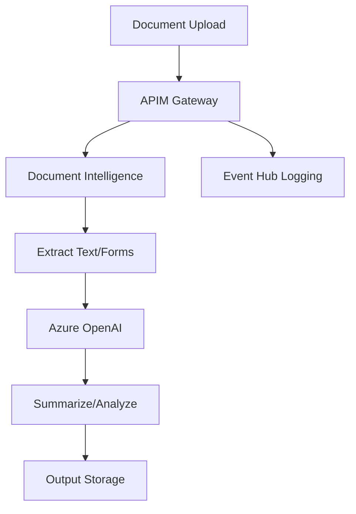

# Document Analysis Pipeline

## Overview
This use case demonstrates onboarding an **Intelligent Document Analysis Pipeline** to the AI Gateway. The pipeline combines Azure Document Intelligence for OCR/extraction with Azure OpenAI for summarization and entity extraction.

## Architecture



## Services Used

| Service | Purpose | API Name in APIM | Policy |
|---------|---------|------------------|--------|
| **Document Intelligence** | OCR, form extraction, layout analysis | `document-intelligence-api` | `doc-policy.xml` |
| **Azure OpenAI** | Document summarization, entity extraction | `azure-openai-service-api` | `oai-policy.xml` |

## Features

- ✅ **Multi-Format Support**: PDF, images, Office documents
- ✅ **Batch Processing**: Up to 500 docs/min via Document Intelligence
- ✅ **Intelligent Summarization**: GPT-4o/mini for document summaries
- ✅ **Cost Optimization**: Automatic model routing based on task complexity
- ✅ **Async Operations**: Long-running document processing support
- ✅ **Detailed Cost Tracking**: Per-request cost estimation

## Prerequisites

1. **APIM Instance** with:
   - `document-intelligence-api` published
   - `azure-openai-service-api` published

2. **Azure Key Vault** (optional - can output credentials directly)

3. **Azure Document Intelligence** resource

4. **Azure OpenAI** with deployed models:
   - `gpt-4o` (complex analysis)
   - `gpt-4o-mini` (simple summaries)
   - `gpt-4-turbo` (batch processing)

5. **Deployment Permissions**:
   - `API Management Service Contributor`
   - `Key Vault Secrets Officer` (if using Key Vault)

## Deployment

### Option 1: Deploy with Key Vault

```powershell
# Edit usecase.bicepparam first, then:
az deployment sub create `
  --name doc-pipeline-onboarding `
  --location eastus `
  --template-file ../../main.bicep `
  --parameters usecase.bicepparam
```

### Option 2: Deploy without Key Vault (CI/CD)

```bicep
// In usecase.bicepparam, set:
param useTargetAzureKeyVault = false
```

```powershell
# Deploy and capture outputs
$deployment = az deployment sub create `
  --name doc-pipeline-onboarding `
  --location eastus `
  --template-file ../../main.bicep `
  --parameters usecase.bicepparam `
  --query properties.outputs.endpoints.value -o json | ConvertFrom-Json

# Extract credentials
$docEndpoint = ($deployment | Where-Object { $_.code -eq 'DOC' }).endpoint
$docKey = ($deployment | Where-Object { $_.code -eq 'DOC' }).apiKey
$oaiEndpoint = ($deployment | Where-Object { $_.code -eq 'OAI' }).endpoint
$oaiKey = ($deployment | Where-Object { $_.code -eq 'OAI' }).apiKey

# Store in environment variables or CI/CD secrets
$env:DOC_ENDPOINT = $docEndpoint
$env:DOC_KEY = $docKey
$env:OAI_ENDPOINT = $oaiEndpoint
$env:OAI_KEY = $oaiKey
```