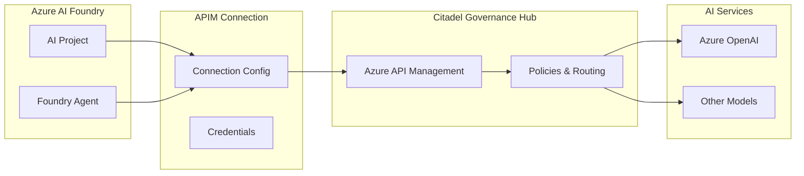
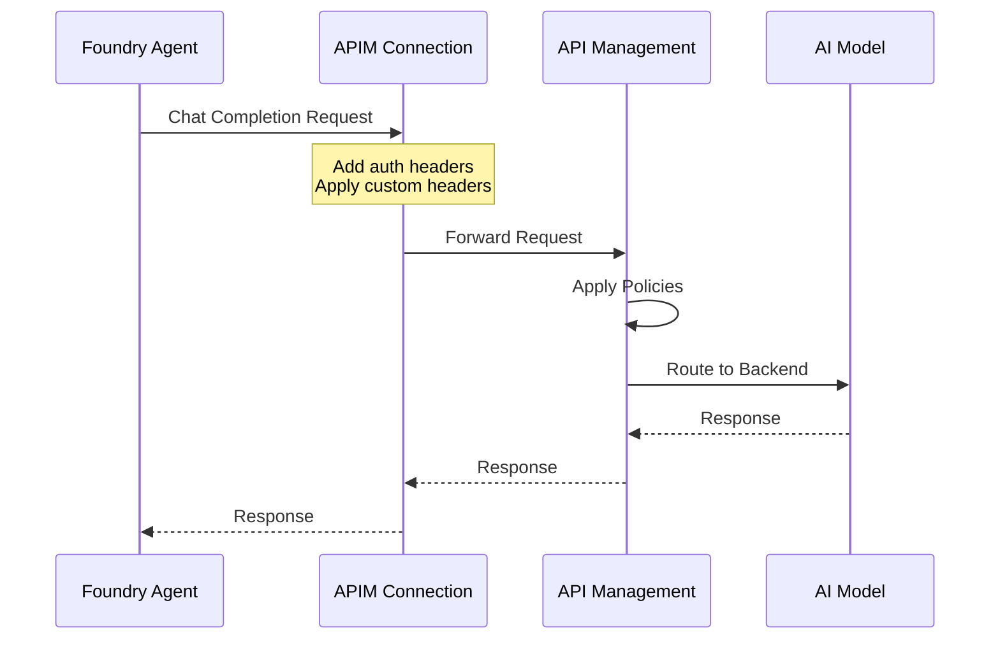

# 🔌 Azure AI Foundry - APIM Connection Integration

This module enables Azure AI Foundry projects to access AI models through your Azure API Management (APIM) gateway, supporting the **Bring Your Own AI Gateway** pattern for enterprise AI governance.

## 📋 Overview

The APIM connection integration allows organizations to:

- **Maintain control** over model endpoints behind your existing governance hub
- **Build agents** that leverage models without exposing them publicly  
- **Apply governance** requirements to AI model access through APIM policies
- **Centralize access** through a single, governed AI gateway

### Architecture



### Request Flow



---

## 📁 Folder Structure

```
foundry-integration/
├── main.bicep                              # Main deployment template
├── main.bicepparam                         # Default parameters (APIM defaults)
├── README.md                               # This documentation
├── modules/
│   └── apim-connection-common.bicep        # Reusable connection module
└── samples/
    ├── static-models.bicepparam            # Static model list configuration
    ├── dynamic-discovery.bicepparam        # Custom discovery endpoints
    ├── custom-headers.bicepparam           # Custom headers for policies
    ├── custom-auth.bicepparam              # Custom authentication config
    └── full-config.bicepparam              # Complete reference example
```

---

## ✅ Prerequisites

| Requirement | Description |
|-------------|-------------|
| **Azure Subscription** | Access to subscription containing AI Foundry |
| **AI Foundry Project** | Existing Foundry account and project |
| **APIM Gateway** | Deployed Citadel Governance Hub or APIM instance |
| **APIM Subscription Key** | Valid subscription key for API access |
| **Azure CLI** | Latest version with Bicep support |
| **Permissions** | Contributor on Foundry resource group |

---

## 🚀 Quick Start

### Step 1: Configure Parameters

Copy and edit the default parameter file:

```bash
cd bicep/infra/foundry-integration
cp main.bicepparam hr-agent-citadel-hub-connection.bicepparam
```

Edit `hr-agent-citadel-hub-connection.bicepparam`:

```bicep
using 'main.bicep'

param aiFoundryAccountName = 'my-foundry-account'
param aiFoundryProjectName = 'my-project'
param connectionName = 'hr-agent-citadel-hub-connection'
param apimGatewayUrl = 'https://my-apim.azure-api.net'
param apiPath = 'models'
param apimSubscriptionKey = 'your-subscription-key'
param deploymentInPath = 'false'
param inferenceAPIVersion = '2024-02-01'
```

### Step 2: Deploy

```bash
# Login and set subscription
az login
az account set --subscription <foundry-subscription-id>

# Deploy the connection
az deployment group create --name foundry-integration --resource-group <foundry-resource-group> --template-file main.bicep --parameters main-local.bicepparam
```

### Step 3: Verify

Check the connection in Azure AI Foundry portal:
1. Navigate to your Foundry project
2. Go to **Operate → Admin → Connected resources**
3. Verify the connection appears and is active

---

## 🔧 Configuration Options

### Model Discovery Methods

Choose **one** of these approaches:

| Method | When to Use | Parameters |
|--------|-------------|------------|
| **APIM Defaults** | Standard APIM setup with `/deployments` endpoints | Leave `staticModels` empty and no custom discovery |
| **Static Models** | Fixed set of known models, no discovery needed | `staticModels = [...]` |
| **Custom Discovery** | Non-standard endpoints or OpenAI format | `listModelsEndpoint`, `getModelEndpoint`, `deploymentProvider` |

#### Option 1: APIM Defaults (Recommended)

APIM provisioned by Citadel Governance Hub supports dynamic model discovery out-of-the-box and it is the recommended approach.

Uses APIM's standard discovery endpoints:
- List: `/deployments`
- Get: `/deployment/{deploymentName}`
- Provider: `AzureOpenAI`

Simply don't provide `staticModels` or custom discovery parameters:

```bicep
// No staticModels or discovery params = APIM defaults
param deploymentInPath = 'false'
param inferenceAPIVersion = '2024-02-01'
```

#### Option 2: Static Model List

Define models explicitly when discovery isn't needed:

```bicep
param staticModels = [
  {
    name: 'gpt-4o'
    properties: {
      model: {
        name: 'gpt-4o'
        version: '2024-11-20'
        format: 'OpenAI'
      }
    }
  }
]
```

#### Option 3: Custom Discovery

For non-standard endpoints or OpenAI format:

```bicep
param listModelsEndpoint = '/models'
param getModelEndpoint = '/models/{deploymentName}'
param deploymentProvider = 'OpenAI'  // or 'AzureOpenAI'
```

### Deployment Path Configuration

Controls how model names are passed in requests:

| Value | URL Format | Request Body |
|-------|------------|--------------|
| `'true'` | `/deployments/{model}/chat/completions` | N/A |
| `'false'` | `/chat/completions` | `{"model": "{model}"}` |

### Custom Headers

Add headers for APIM policy routing:

```bicep
param customHeaders = {
  'X-Environment': 'production'
  'X-Route-Policy': 'premium'
  'X-Client-App': 'foundry-agents'
}
```

---

## 📋 Parameter Reference

### Required Parameters

| Parameter | Type | Description |
|-----------|------|-------------|
| `aiFoundryAccountName` | string | Name of the AI Foundry account |
| `aiFoundryProjectName` | string | Name of the project within Foundry |
| `connectionName` | string | Unique name for the connection |
| `apimGatewayUrl` | string | APIM gateway URL (e.g., `https://my-apim.azure-api.net`) |
| `apiPath` | string | API path in APIM (e.g., `openai`) |
| `apimSubscriptionKey` | string | APIM subscription key (secure) |

### Optional Parameters

| Parameter | Type | Default | Description |
|-----------|------|---------|-------------|
| `authType` | string | `'ApiKey'` | Authentication type |
| `isSharedToAll` | bool | `false` | Share with all project users |
| `deploymentInPath` | string | `'true'` | Deployment name in URL path |
| `inferenceAPIVersion` | string | `''` | API version for inference |
| `deploymentAPIVersion` | string | `''` | API version for discovery |
| `staticModels` | array | `[]` | Static model list |
| `listModelsEndpoint` | string | `''` | Custom list endpoint |
| `getModelEndpoint` | string | `''` | Custom get endpoint |
| `deploymentProvider` | string | `''` | Discovery provider format |
| `customHeaders` | object | `{}` | Custom request headers |
| `authConfig` | object | `{}` | Custom auth configuration |

---

## 📦 Sample Configurations

### Using APIM Defaults
```bash
az deployment group create \
  --resource-group <rg> \
  --template-file main.bicep \
  --parameters hr-agent-citadel-hub-connection.bicepparam
```
---

## 🧪 Using the Connection in Agents

After creating the connection, reference it in your Foundry agent:

```python
import os
from azure.ai.projects import AIProjectClient
from azure.identity import DefaultAzureCredential

# Configure model deployment name as: {connection-name}/{model-name}
model_deployment = "hr-agent-citadel-hub-connection/gpt-4o"
os.environ["AZURE_AI_MODEL_DEPLOYMENT_NAME"] = model_deployment

# Create agent client
client = AIProjectClient(
    credential=DefaultAzureCredential(),
    endpoint="https://your-foundry.cognitiveservices.azure.com/"
)

# Create and run agent
agent = client.agents.create_agent(
    model=model_deployment,
    name="my-agent",
    instructions="You are a helpful assistant."
)
```

---

---

## 📚 References

- [Bring Your Own AI Gateway to Foundry](https://learn.microsoft.com/en-us/azure/ai-foundry/agents/how-to/ai-gateway)
- [APIM Connection Objects](https://github.com/azure-ai-foundry/foundry-samples/blob/main/infrastructure/infrastructure-setup-bicep/01-connections/apim/APIM-Connection-Objects.md)
- [Foundry Samples Repository](https://github.com/azure-ai-foundry/foundry-samples)
- [Azure AI Projects Agent Samples](https://github.com/Azure/azure-sdk-for-python/tree/main/sdk/ai/azure-ai-projects/samples/agents)

---

## ⚠️ Current Limitations

| Limitation | Details |
|------------|---------|
| **Preview Status** | Feature is in preview with potential breaking changes |
| **UI Support** | Requires Azure CLI for connection management |
| **Agent Support** | Supports Prompt Agents in the Agent SDK |
| **APIM Tiers** | Only Standard v2 and Premium tiers supported if network isolation is required |
| **Auth Types** | Only ApiKey authentication currently (Entra ID coming soon) |

