# Network Architecture

## Network Deployment Approaches

AI Citadel Governance Hub supports **two architectural patterns** for network integration.

Based on your decisions in the earlier checklist, choose one of the following approaches:

### **Approach 1: Hub-Based (Citadel as Part of Hub)**

In this approach, the Citadel Governance Hub is deployed within the existing hub virtual network (VNet) of your enterprise Azure Landing Zone.

This allows for direct communication between the unified AI gateway and connected agentic spokes, leveraging existing security and networking configurations.


>**Note:** When AI Backends reside in a different spoke networks, their traffic should be forced through the hub firewall to maintain integrity of the network traffic flow.*

#### Traffic Flow

- Routed requests originate from spoke-hosted agents.
- Traffic is directly forwarded to AI Gateway for governance, security, and observability enforcement.
- Traffic intelligently routed out to managed LLMs, tools, or downstream agents (gateway-spoke-network).

**Deployment Configuration:**
```bicep
param useExistingVnet = true
param vnetName = 'vnet-hub-eastus'
param existingVnetRG = 'rg-network-hub'
param apimSubnetName = 'snet-citadel-apim'
param privateEndpointSubnetName = 'snet-citadel-private-endpoints'
param dnsZoneRG = 'rg-network-hub'
param dnsSubscriptionId = '<hub-subscription-id>'
```

**When to Use:**
- ✅ Citadel manages all enterprise AI traffic
- ✅ Direct spoke-to-hub connectivity
- ✅ Simplified network topology

### **Approach 2: Hub-Spoke-Hub (Citadel as Dedicated Spoke)**

In this approach, the Citadel Governance Hub is deployed within a dedicated spoke VNet that connects to the hub VNet via VNet peering. 

Agentic workloads in other spokes are routed first to the hub network firewall through direct peering, then forwarded to the Citadel Governance Hub gateway network.

This provides an additional layer of isolation for AI workloads while still enabling secure communication with other enterprise resources in the hub.

```mermaid
%%{init: {
  'theme': 'base',
  'themeVariables': {
    'primaryColor': '#0078d4',
    'primaryTextColor': '#fff',
    'primaryBorderColor': '#0078d4',
    'lineColor': '#8a8886',
    'secondaryColor': '#d13438',
    'tertiaryColor': '#f3f2f1',
    'noteBkgColor': '#fef9e7',
    'noteTextColor': '#323130',
    'noteBorderColor': '#d4a300',
    'actorBkg': '#0078d4',
    'actorBorder': '#005a9e',
    'actorTextColor': '#fff',
    'actorLineColor': '#8a8886',
    'signalColor': '#323130',
    'signalTextColor': '#323130',
    'labelBoxBkgColor': '#e1dfdd',
    'labelBoxBorderColor': '#605e5c',
    'labelTextColor': '#323130',
    'loopTextColor': '#323130',
    'activationBorderColor': '#0078d4',
    'activationBkgColor': '#deecf9',
    'sequenceNumberColor': '#fff'
  }
}}%%
sequenceDiagram
    autonumber
    
    participant Agent as 🤖 Spoke Agent<br/>(Agent Spoke Network)
    participant Firewall as 🛡️ Hub Firewall<br/>(Hub Network)
    participant Gateway as 🚪 AI Gateway<br/>(Gateway Spoke Network)
    participant Backends as ⚡ AI Backends<br/>(Spoke Network*)

    Note over Agent,Backends: 🔷 Spoke-Based Governance with Firewall Isolation
    
    rect rgba(0, 120, 212, 0.1)
        Note right of Agent: Step 1: Request Initiation
        Agent->>+Firewall: AI Request via Peering
    end
    
    rect rgba(209, 52, 56, 0.1)
        Note over Firewall: Step 2: Network Security Inspection
        Firewall->>+Gateway: Forward Approved Traffic
    end
    
    rect rgba(80, 230, 255, 0.1)
        Note over Gateway: Step 3: AI Governance Layer
        Gateway->>+Backends: Governed Request to LLM/Agent/Tool
    end
    
    rect rgba(16, 124, 16, 0.1)
        Note over Backends: Step 4: AI Processing
        Backends-->>-Gateway: AI Response + Telemetry
    end
    
    rect rgba(147, 51, 234, 0.1)
        Note over Gateway: Step 5: Response Validation
        Gateway-->>-Firewall: Validated Response
    end
    
    rect rgba(209, 52, 56, 0.1)
        Note over Firewall: Step 6: Egress Inspection
        Firewall-->>-Agent: Secured AI Response
    end
    
    Note over Agent,Backends: 🔒 Defense-in-depth with dual security layers<br/>✅ Network isolation + AI governance
```



>**Note:** * When AI Backends reside in a different spoke networks, their traffic should be forced through the hub firewall to maintain integrity of the network traffic flow.*

#### Traffic isolation flow

- Routed requests originate from spoke-hosted agents (agent-spoke-network).
- Traffic first routed to hub network firewall for inspection (hub-network).
- Hub Firewall forwards to AI Gateway for governance, security, and observability enforcement (gateway-spoke-network).
- Traffic intelligently routed out to managed LLMs, tools, or downstream agents (through the hub firewall or directly).
- AI Backend responses may still be routed through the hub firewall for final inspection before reaching spoke agents, depending on governance policy.

**Deployment Configuration:**
```bicep
param useExistingVnet = false  // Creates new spoke VNet
param vnetName = 'vnet-citadel-eastus'
param vnetAddressPrefix = '10.170.0.0/24'
param apimSubnetPrefix = '10.170.0.0/26'
param privateEndpointSubnetPrefix = '10.170.0.64/26'
param functionAppSubnetPrefix = '10.170.0.128/26'
param dnsZoneRG = 'rg-network-hub'
param dnsSubscriptionId = '<hub-subscription-id>'

// Post-deployment: Configure VNet peering to hub
```

**When to Use:**
- ✅ Defense-in-depth security (dual inspection)
- ✅ Isolated AI workloads from general traffic
- ✅ Separate cost centers/subscriptions
- ✅ Compliance requirements for network isolation

>Note: Post deployment, you must configure VNet peering, DNS servers and route tables between the Citadel spoke and your hub VNet to enable connectivity.

---

## Network Setup Options

### **Option 1: Create New Network (Greenfield)**

Accelerator will create all networking components:

```bicep
param useExistingVnet = false
param vnetAddressPrefix = '10.170.0.0/24'
param apimSubnetPrefix = '10.170.0.0/26'
param privateEndpointSubnetPrefix = '10.170.0.64/26'
param functionAppSubnetPrefix = '10.170.0.128/26'

// Network access
param apimNetworkType = 'External'  // or 'Internal' for production
param apimV2UsePrivateEndpoint = true
```

**Includes:**
- ✅ Virtual Network with subnets
- ✅ Network Security Groups
- ✅ Private DNS Zones
- ✅ Private Endpoints for all services
- ✅ Route table (needed for APIM Developer and Premium SKUs)

---

### **Option 2: Bring Your Own Network (Brownfield)**

Integrate with existing enterprise network:

```bicep
param useExistingVnet = true
param vnetName = 'vnet-hub-prod-eastus'
param existingVnetRG = 'rg-network-prod'

// Subnet names (must exist)
param apimSubnetName = 'snet-citadel-apim'
param privateEndpointSubnetName = 'snet-citadel-pe'
param functionAppSubnetName = 'snet-citadel-functions'

// DNS configuration
param existingPrivateDnsZones = {
  keyVault: '/subscriptions/{sub-id}/resourceGroups/{rg}/providers/Microsoft.Network/privateDnsZones/privatelink.vaultcore.azure.net'
  ...
}
```

**Prerequisites:**
1. VNet with sufficient address space
2. Three subnets created (see [Subnet Requirements](#subnet-requirements))
    - APIM subnet /26 or larger
    - Function App subnet /26 or larger
    - Private Endpoints subnet /26 or larger
3. Private DNS zones created and linked (see [Required DNS Zones](#required-dns-zones))
4. NSG rules configured for APIM subnet (see [APIM Subnet](#apim-subnet))

---

## Subnet Requirements

### APIM Subnet

Dedicated subnet with `/26` or larger address space.

#### For Developer/Premium SKU (VNet Injection)

**NSG Rules Required:**

| Direction | Priority | Name | Port | Source | Destination | Purpose |
|-----------|----------|------|------|--------|-------------|---------|
| Inbound | 3000 | AllowPublicAccess* | 443 | Internet | VirtualNetwork | Gateway access |
| Inbound | 3010 | AllowAPIMManagement | 3443 | ApiManagement | VirtualNetwork | Control plane |
| Inbound | 3020 | AllowAPIMLoadBalancer | 6390 | AzureLoadBalancer | VirtualNetwork | Health probes |
| Inbound | 3030 | AllowAzureTrafficManager* | 443 | AzureTrafficManager | VirtualNetwork | Traffic routing |
| Outbound | 3000 | AllowStorage | 443 | VirtualNetwork | Storage | Configuration |
| Outbound | 3010 | AllowSql | 1433 | VirtualNetwork | Sql | Metadata |
| Outbound | 3020 | AllowKeyVault | 443 | VirtualNetwork | AzureKeyVault | Secrets |
| Outbound | 3030 | AllowMonitor | 1886, 443 | VirtualNetwork | AzureMonitor | Diagnostics |

> *Only required for External mode

**Route Table Required (Only for APIM Developer/Premium SKUs):**

```bicep
properties: {
  routes: [
    {
      name: 'apim-management'
      properties: {
        addressPrefix: 'ApiManagement'
        nextHopType: 'Internet'
      }
    }
  ]
}
```
>Note: This is a route record that you must add to your existing route table if using existing route table and it is ensure APIM can reach the control fabric communication, which fully private.

**Service Endpoints (if forced tunneling):**
- Microsoft.Storage
- Microsoft.Sql
- Microsoft.KeyVault
- Microsoft.ServiceBus
- Microsoft.EventHub
- Microsoft.AzureActiveDirectory

#### For StandardV2/PremiumV2 SKU (Private Endpoint)

- Subnet delegated to `Microsoft.Web/serverFarms`
- No route table required
- Private endpoint provides inbound connectivity

---

### Logic App Subnet

Dedicated subnet with `/26` or larger, delegated to `Microsoft.Web/serverFarms`:

```bicep
{
  name: 'snet-citadel-functions'
  properties: {
    addressPrefix: '10.x.x.x/26'
    delegations: [
      {
        name: 'Microsoft.Web/serverFarms'
        properties: {
          serviceName: 'Microsoft.Web/serverFarms'
        }
      }
    ]
    privateEndpointNetworkPolicies: 'Enabled'
  }
}
```

---

### Private Endpoints Subnet

Dedicated subnet with `/26` or larger for all private endpoints:

```bicep
{
  name: 'snet-citadel-pe'
  properties: {
    addressPrefix: '10.x.x.x/26'
    privateEndpointNetworkPolicies: 'Disabled'
    privateLinkServiceNetworkPolicies: 'Enabled'
  }
}
```

> For APIM V2 SKUs, private endpoints in this subnet enable private inbound connectivity.

---

## DNS Configuration

### Private DNS Zones

Depending on your permissions and DNS zone distribution, choose one of these approaches:

**Option A: Use Existing DNS Zones with Resource IDs (Recommended)**

For maximum flexibility, specify each DNS zone by its full resource ID. This approach supports DNS zones across different subscriptions and resource groups:

```bicep
param existingPrivateDnsZones = {
  keyVault: '/subscriptions/{sub-id}/resourceGroups/{rg}/providers/Microsoft.Network/privateDnsZones/privatelink.vaultcore.azure.net'
  monitor: '/subscriptions/{sub-id}/resourceGroups/{rg}/providers/Microsoft.Network/privateDnsZones/privatelink.monitor.azure.com'
  eventHub: '/subscriptions/{sub-id}/resourceGroups/{rg}/providers/Microsoft.Network/privateDnsZones/privatelink.servicebus.windows.net'
  cosmosDb: '/subscriptions/{sub-id}/resourceGroups/{rg}/providers/Microsoft.Network/privateDnsZones/privatelink.documents.azure.com'
  storageBlob: '/subscriptions/{sub-id}/resourceGroups/{rg}/providers/Microsoft.Network/privateDnsZones/privatelink.blob.core.windows.net'
  storageFile: '/subscriptions/{sub-id}/resourceGroups/{rg}/providers/Microsoft.Network/privateDnsZones/privatelink.file.core.windows.net'
  storageTable: '/subscriptions/{sub-id}/resourceGroups/{rg}/providers/Microsoft.Network/privateDnsZones/privatelink.table.core.windows.net'
  storageQueue: '/subscriptions/{sub-id}/resourceGroups/{rg}/providers/Microsoft.Network/privateDnsZones/privatelink.queue.core.windows.net'
  cognitiveServices: '/subscriptions/{sub-id}/resourceGroups/{rg}/providers/Microsoft.Network/privateDnsZones/privatelink.cognitiveservices.azure.com'
  apimGateway: '/subscriptions/{sub-id}/resourceGroups/{rg}/providers/Microsoft.Network/privateDnsZones/privatelink.azure-api.net'
  aiServices: '/subscriptions/{sub-id}/resourceGroups/{rg}/providers/Microsoft.Network/privateDnsZones/privatelink.services.ai.azure.com'
}
```

> **Note:** You only need to specify the DNS zones relevant to your deployment. The `existingPrivateDnsZones` parameter takes precedence over the legacy `dnsZoneRG`/`dnsSubscriptionId` approach when both are provided.

**Option B: Use Existing Central DNS Zones (Legacy)**

If all your DNS zones are in a single subscription and resource group:

```bicep
param dnsZoneRG = 'rg-network-dns'
param dnsSubscriptionId = '<dns-subscription-id>'
```

> **Note:** This legacy approach is maintained for backward compatibility but Option A is recommended for new deployments.

**Option C: Create New DNS Zones**

Leave all DNS parameters empty to create new zones (requires manual VNet linking after provisioning):

```bicep
param existingPrivateDnsZones = {}
param dnsZoneRG = ''
param dnsSubscriptionId = ''
```

> Post-deployment: Link new zones to your VNet or configure central DNS resolver.

### APIM Internal Mode DNS

When using `apimNetworkType = 'Internal'`, DNS resolution must be configured:

**Recommended: Custom Domains**
- Configure custom domains for Gateway, Management, and Portal endpoints
- Use wildcard CA-issued certificate (e.g., `*.api.az.company.com`)
- Ensure network DNS resolver routes to APIM private IPs

**Alternative: Private DNS Zone**
- Create `azure-api.net` private DNS zone
- Add A records for all 5 APIM endpoints pointing to private IP
- Link zone to VNet

> **WARNING:** Using private `azure-api.net` zone may conflict with external APIM instances using public DNS. Add public IP records for external instances if needed. Failure to do so may lead to resolution issues for other APIM services that are external or without network integration.

---

## Required DNS Zones

All zones must be linked to your VNet:

| DNS Zone | Purpose |
|----------|---------|
| `privatelink.cognitiveservices.azure.com` | Azure OpenAI / Cognitive Services |
| `privatelink.openai.azure.com` | Azure OpenAI |
| `privatelink.vaultcore.azure.net` | Key Vault |
| `privatelink.monitor.azure.com` | Azure Monitor |
| `privatelink.servicebus.windows.net` | Event Hub |
| `privatelink.documents.azure.com` | Cosmos DB |
| `privatelink.blob.core.windows.net` | Storage Blob |
| `privatelink.file.core.windows.net` | Storage File |
| `privatelink.table.core.windows.net` | Storage Table |
| `privatelink.queue.core.windows.net` | Storage Queue |
| `privatelink.azure-api.net` | APIM V2 SKUs |
| `privatelink.services.ai.azure.com` | Azure AI Foundry |

> **Azure Monitor:** Requires special Private Link Scope configuration post-deployment for centralized monitoring.

## Azure services network access settings

Although the accelerator deploys services with private endpoints by default with disabled public access, some services may require specific network access settings to be configured based on your network architecture and security requirements.

| Service | Parameter | Default | Allowed Values | Description |
|---------|-----------|---------|----------------|-------------|
| **API Management (Developer/Premium)** | `apimNetworkType` | `External` | `External`, `Internal` | Network type for APIM VNet injection. `Internal` mode requires custom DNS configuration. |
| **API Management (StandardV2/PremiumV2)** | `apimV2UsePrivateEndpoint` | `true` | `true`, `false` | Enable private endpoint for inbound connectivity on V2 SKUs. |
| **API Management (StandardV2/PremiumV2)** | `apimV2PublicNetworkAccess` | `true` | `true`, `false` | Allow public network access. Set to `false` to restrict to private endpoint only. |
| **Cosmos DB** | `cosmosDbPublicAccess` | `Disabled` | `Enabled`, `Disabled` | Public network access for Cosmos DB. Keep `Disabled` for secure deployments. |
| **Event Hub** | `eventHubNetworkAccess` | `Enabled` | `Enabled`, `Disabled` | Public network access. Note: Must be `Enabled` during initial provisioning for APIM V2 SKUs. |
| **Azure Language Service** | `languageServiceExternalNetworkAccess` | `Disabled` | `Enabled`, `Disabled` | External network access for PII redaction and text analytics. |
| **Azure Content Safety** | `aiContentSafetyExternalNetworkAccess` | `Disabled` | `Enabled`, `Disabled` | External network access for content moderation service. |
| **AI Foundry** | `aiFoundryExternalNetworkAccess` | `Disabled` | `Enabled`, `Disabled` | External network access for AI Foundry resources. |
| **Azure Monitor** | `useAzureMonitorPrivateLinkScope` | `false` | `true`, `false` | Use Private Link Scope for Log Analytics and Application Insights. Requires additional configuration. |

**Configuration Example:**

```bicep
// Fully private deployment (recommended for production)
param apimNetworkType = 'Internal'
param apimV2UsePrivateEndpoint = true
param apimV2PublicNetworkAccess = false
param cosmosDbPublicAccess = 'Disabled'
param eventHubNetworkAccess = 'Disabled'  // Set after initial deployment
param languageServiceExternalNetworkAccess = 'Disabled'
param aiContentSafetyExternalNetworkAccess = 'Disabled'
param aiFoundryExternalNetworkAccess = 'Disabled'
param useAzureMonitorPrivateLinkScope = true
```

> **Important Notes:**
> - Event Hub must have public access `Enabled` during initial deployment when using APIM V2 SKUs. You can disable it post-deployment.
> - When `apimNetworkType = 'Internal'`, ensure proper DNS configuration for APIM endpoints.
> - Azure Monitor Private Link Scope requires additional post-deployment configuration for centralized monitoring as Azure Monitor private link scope is a global resource and impact all Log Analytics and Application Insights workspaces across subscriptions when connecting to the same hub network.